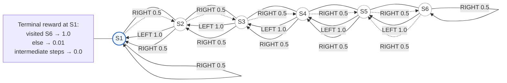

# Simple Chain6 Environment for Hierarchical vs Flat RL Comparison

This repository contains a compact, reproducible setup to compare tabular Q-learning (flat) vs a tabular hierarchical controller on the classic Chain6 environment. The goal is to show how temporal abstraction (sub-goals/options) helps discover a delayed reward path that is hard for flat exploration.

## Quickstart

```bash
# 1) Install deps (Python 3.13 recommended)
uv sync
# or: python -m pip install -e .

# 2) Run the experiment
uv run src/run.py

# 3) Results
# -> results/<YYYYMMDD>_<uuid8>/aggregated.csv
# -> results/<YYYYMMDD>_<uuid8>/plot.png
```

The script runs both agents across multiple random seeds in parallel (Python `multiprocessing`), aggregates a moving average over episodes, and plots mean ± uncertainty band ($\sigma$ or percentiles).

## What’s the Chain6 environment?

A chain of 6 states:

- States: `S1`, `S2`, `S3`, `S4`, `S5`, `S6` (agent starts at `S2`)
- Actions: `LEFT` (deterministic) and `RIGHT` (stochastic)
  - `LEFT`: moves one step to the left (stays in `S1` if already there)
  - `RIGHT`: with probability p moves right; otherwise moves left
- Terminal: reaching `S1` ends the episode

Reward at terminal (extrinsic):

- If the agent visited `S6` sometime during the episode: reward 1.0
- Otherwise: reward 0.01
- All intermediate steps: reward 0.0

This creates a sparse reward: the safe “short path” to `S1` yields 0.01 forever; the “long path” that goes to `S6` first is harder to find, but yields 1.0.



## Agents

### Flat tabular Q-Learning

- Epsilon-greedy exploration with linear annealing.
- Standard TD target with $\gamma$.
- Learns a single state-action value table $Q(s, a)$.

### Hierarchical tabular controller (h-Q-learning style)

- Meta-controller (`Q2`) picks a sub-goal $g \epsilon {3, 4, 5, 6}$.
- Controller (`Q1`) acts to reach the chosen $g$ using an intrinsic reward of 1 when hitting $g$, 0 otherwise.
- When the option terminates (hit $g$ or episode ends), `Q2` updates on the accumulated extrinsic reward and the discounted continuation.
- Separate epsilon schedules for the meta-policy and each controller policy.

Result: the option structure helps the agent purposefully travel rightward to visit `S6` and unlock the large terminal reward.
